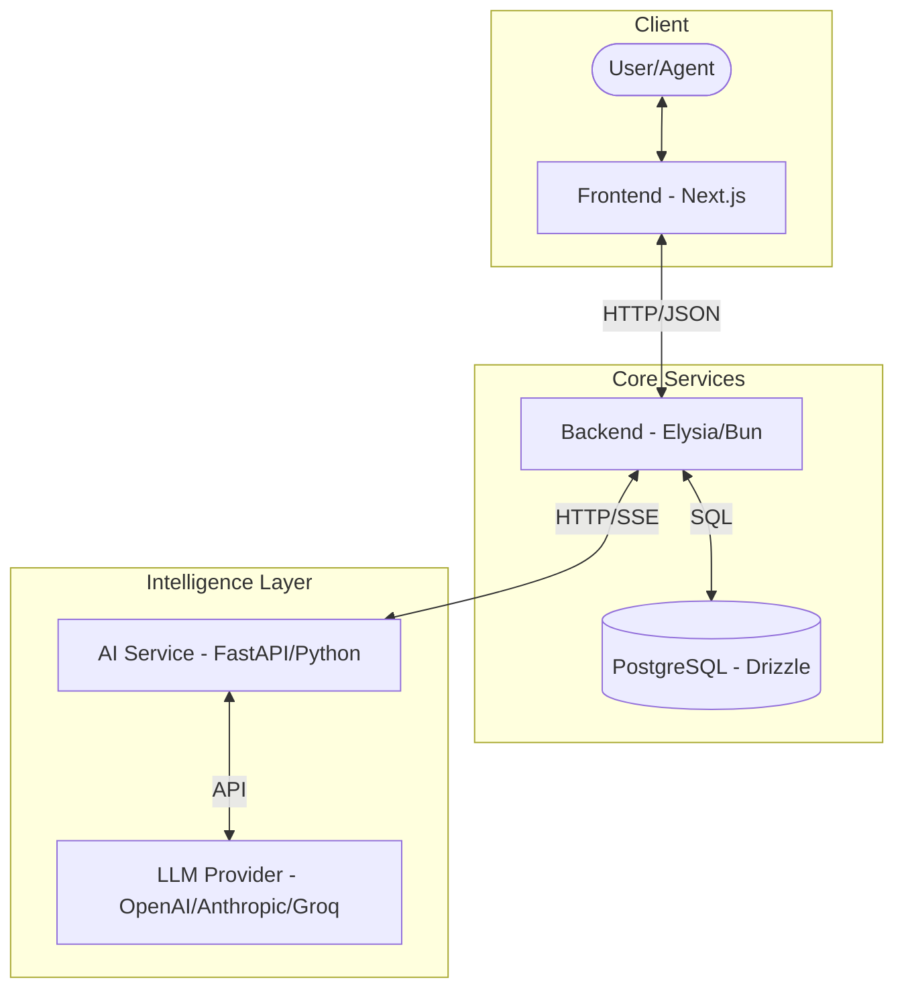

# Section B: Written Report

---

# B.1 Architecture Overview - Farubikon

Farubikon is an AI-powered ticketing system designed for multi-tenant organizations. It leverages a three-service architecture to separate concerns between the user interface, business logic/persistence, and intelligent processing.

## 1. System Architecture Diagram

### Service Communication

- **Frontend ↔ Backend**: RESTful API communication using JSON. Authentication is handled via BetterAuth session cookies.
- **Backend ↔ AI Service**:
  - **Classification**: Synchronous HTTP POST request from Backend to AI Service.
  - **AI Suggestions**: Server-Sent Events (SSE) proxying. The AI Service streams the response to the Backend, which then proxies it to the Frontend for a real-time typing effect.
- **AI Service ↔ LLM**: External API calls to model providers (OpenAI, Anthropic, or Groq) using LangChain.

## 2. Request Lifecycles

### (1) Creating a Ticket

1.  **User Input**: An authenticated user submits a ticket title and description via the **Frontend**.
2.  **Backend Entry**: The **Backend** receives the request, validates the session, and identifies the `organizationId`.
3.  **Draft Persistence**: The **Backend** automatically fetches the user's `name` and `email` from the database and inserts a new record into the `tickets` table.
4.  **Trigger AI**: After successful insertion, the **Backend** sends a background HTTP request to the **AI Service** (`/classify` endpoint).
5.  **AI Processing**: The **AI Service** analyzes the title and description using an LLM to determine the appropriate `category` and `priority`.
6.  **Final Update**: The **Backend** updates the ticket record with the AI-suggested metadata.
7.  **UI Refresh**: The **Frontend** receives the success response and redirects the user to the ticket list or detail view.

### (2) Getting an AI Response Suggestion

1.  **Agent Request**: An agent clicks "Suggest Response" on the **Frontend** ticket detail page.
2.  **Request Initiation**: The **Frontend** opens an EventSource connection (or uses Fetch for streaming) to the **Backend**'s SSE endpoint.
3.  **Backend Proxy**: The **Backend** authenticates the request and forwards it to the **AI Service** (`/suggest-response` endpoint), providing ticket content and existing comment history as context.
4.  **Stream Generation**: The **AI Service** invokes the LLM with a specialized prompt and begins receiving a stream of tokens.
5.  **Streaming Flow**:
    - The **AI Service** streams tokens to the **Backend**.
    - The **Backend** pipes the stream directly to the **Frontend**.
6.  **Real-time UI**: The **Frontend** updates the UI token-by-token, showing the response "writing itself."
7.  **Finalization**: Once complete, the agent can choose to "Post as Comment," which converts the suggested text into a standard ticket comment.

## B.2 Key Design Decisions

### Decision 1: Adding `reporter_id` to the Tickets Table

**What the Decision Was**

The original ticket schema did not include a `reporter_id` field. I added a `reporter_id` column to track which user created each ticket.

**Alternatives Considered**
- Relying only on session-based ownership.
- Storing user details directly inside the ticket.
- Using a generic metadata field for ownership.

**Why I Chose This Approach**

Adding a dedicated `reporter_id`:
- Enables proper authorization (only the creator can edit/delete).
- Maintains database normalization.
- Simplifies querying tickets by user.
- Improves data integrity and access control.

### Decision 2: Creating Separate `organizations` and `members` Tables

**What the Decision Was**

I created separate tables for `organizations` and `members` to support structured multi-tenancy.

**Alternatives Considered**
- Single user table without organization separation.
- Storing organization name as a string inside users.
- Ignoring multi-tenancy.

**Why I Chose This Approach**

This design:
- Establishes clear organization-user relationships.
- Enables proper multi-tenancy.
- Prevents cross-organization data leakage.
- Makes the system scalable like real SaaS platforms.

### Decision 3: Creating a Centralized `API.ts` Utility File

**What the Decision Was**

I created a centralized `API.ts` file in the frontend utils folder to structure all API calls.
Example usage: `API.ticket.get`, `API.ticket.create`, `API.ticket.delete`.

**Alternatives Considered**
- Writing fetch/axios calls inside every component.
- Creating separate API files per feature.
- Using inline API calls without abstraction.

**Why I Chose This Approach**
- Prevents repetition.
- Keeps UI components clean.
- Makes endpoint updates easier.
- Improves maintainability and scalability.

### Decision 4: Implementing Multi-Provider LLM Support

**What the Decision Was**

The AI service supports multiple providers: OpenAI, Anthropic, and Groq. Provider and model are configured using environment variables.

**Alternatives Considered**
- Hardcoding a single provider.
- Separate service per provider.
- Frontend-based provider selection.

**Why I Chose This Approach**
- Avoids vendor lock-in.
- Allows easy model switching.
- Follows production-level configuration practices.
- Makes the AI service modular and future-ready.

## B.3 AI Usage Log

### 1. Project Planning & Architecture Guidance

**What I Asked**

I provided full project context to Claude (Sonnet 4.6 Extended) and asked for:
- Development order
- Service boundaries
- Boilerplate structures

**What It Generated**
- Recommended building backend → AI service → frontend.
- Suggested folder structures.
- Provided initial boilerplate.

**What I Accepted / Modified / Rejected**

**Accepted**:
- Development sequence.
- Structural guidance.

**Modified**:
- Folder structure to match company standards.
- Naming conventions.
- Error handling logic.

**Rejected**:
- Structural assumptions that did not fit my architecture.

AI was used as a guide, not as a final authority.

### 2. Backend & AI Service Development

AI helped generate:
- Route templates.
- LLM integration examples.
- Basic service structures.

All code was manually reviewed and refactored. Multi-provider logic and environment configuration were implemented manually. No autonomous coding agents were used for backend or AI services.

### 3. Frontend Generation & UI Assistance

After defining frontend structure manually, I used Claude Opus 4.6 to generate Tailwind-based UI components.

**Accepted**:
- Base layout.
- Component structure.

**Modified**:
- UI spacing.
- Responsiveness.
- API integration logic.
- State management refinements.

AI accelerated UI development while architectural control remained manual.

## B.4 Challenges & Learnings

### Hardest Part

The most challenging part was implementing multi-tenancy using Better Auth, as it was my first time working with it.

Understanding:
- Organization handling
- Session management
- RBAC logic
- Member relationships

required additional learning. To simplify management, I decided to automatically create a default organization when a new user registers. This made authorization and tenant isolation cleaner and more reliable.

### Concepts That Clicked

This project strengthened my understanding of:
- Multi-tenancy architecture
- API route design
- Server-Sent Events (SSE) streaming
- Reverse proxy flow
- Session-based authentication
- RBAC models
- Service-oriented architecture

Implementing these concepts in a real system helped bridge theory and practical engineering.

### What I Would Do Differently

If I restarted the project, I would:
- Design multi-tenancy relationships more deeply before coding.
- Create detailed authorization diagrams earlier.
- Define RBAC rules upfront.
- Modularize backend services earlier.

Better upfront planning would reduce refactoring time, though the refactoring process itself was a valuable learning experience.
